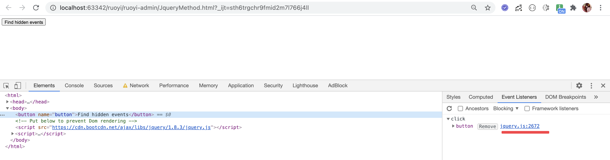

###  Chrome里找出Jquery绑定的事件

一般来说我们在Chrome里面想找出元素对应的事件时，会在Chrome 开发工具中的Tab Elements > Event Listeners 审查。
但是一般会遇到下面的问题。

借助搜索引擎的力量多次搜索之后也是没能找到满意的答案，于是自己动手丰衣足食吧。


### 简单的Html模拟页面
```
<html >
<head>
    <meta charset="UTF-8"> <!-- for HTML5 -->
</head>
<body>

<button name="button" >Find hidden events</button>

<!-- Put below to prevent Dom rendering -->
<script src="https://cdn.bootcdn.net/ajax/libs/jquery/1.8.3/jquery.js"></script>
<script>
    $(function () {
        $("button[name='button']").on("click",function (e,args) {
            debugger
            console.debug("Find hidden events debugger log !")
        })
    })
</script>
</body>
</html>
```
### 开始Debugger
点进去上图中红线中Jquery.js.2672

标红线位置是Jquery接下来要执行的函数，我们的事件处理函数就会在这个apply函数内找到。
箭头指向的是此次事件的对象，在这里可以查看一下对应的type，如果不是想查看的事件就跳过，我这里是click。
然后进入函数 F11。 Mac快捷键 Command + ;


### 在Jquery apply 找到对应的事件处理函数
F11后代码就会停留在红箭头标记的行。
tips 红框内标记的是进入函数的按钮。


鼠标往下滑动，滑动到下图中相同位置。

这里说明一下，我这里用的是jquery1.8.3 ，不同版本可能代码行数不同。
Jquery3.5.1也同样适用哦。


马上揭晓答案。
完活，开心。

编程本就是孤独的旅程。


Syntax highlighted code block

# Header 1
## Header 2
### Header 3

- Bulleted
- List

1. Numbered
2. List

**Bold** and _Italic_ and `Code` text

[Link](url) and 
```


